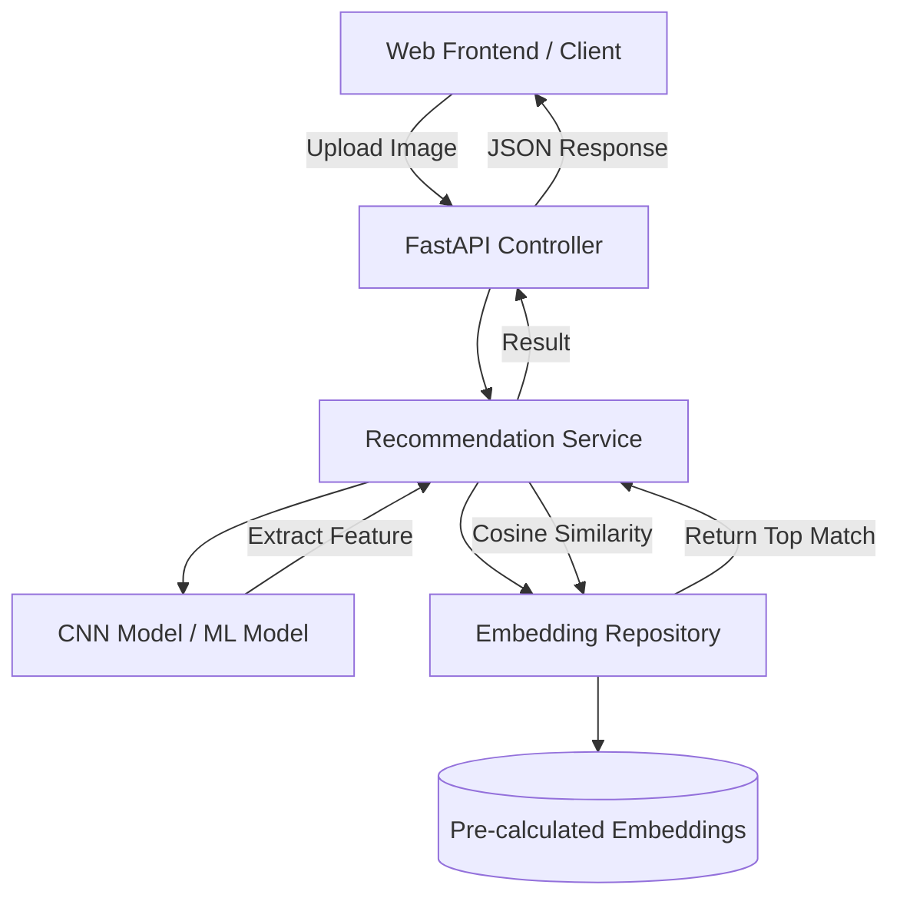

# 🧑‍💼 AI-Powered Person Image Classifier & Recommendation System

## 인공지능 기반 인물 이미지 분류 및 추천 시스템

<p align="center">
  
  
  
  
</p>

---

## 🇰🇷 프로젝트 개요 (Korean Overview)

이 프로젝트는 사용자가 업로드한 얼굴 이미지에서 고유한 특징(Embedding)을 추출하고, 기학습된 유명인 데이터셋(PubFig)과 비교하여 가장 유사한 인물을 찾아 추천해주는 **지능형 인물 이미지 분류기**입니다.

### 🌟 핵심 기능

- **얼굴 특징 추출**: 최신 CNN 모델을 활용하여 얼굴의 기하학적 특징을 512차원 벡터로 수치화합니다.
- **유사도 분석**: 코사인 유사도(Cosine Similarity) 알고리즘을 기반으로 가장 높은 일치율을 보이는 인물을 실시간으로 검색합니다.
- **클린 아키텍처**: 유지보수와 확장이 용이하도록 계층형 클린 아키텍처(Controller-Service-Repository-Domain)를 적용했습니다.
- **휘발성 이미지 처리 (Security)**: 사용자가 업로드한 파일은 서버에 절대 저장되지 않으며, 메모리 상에서 즉시 처리된 후 파기됩니다.
- **고성능 웹 API**: FastAPI를 사용하여 빠르고 비동기적인 이미지 처리 서비스를 제공합니다.

---

## 🇺🇸 Project Overview (English Overview)

This project is an **AI-powered Person Image Classifier & Recommendation System** that extracts unique facial embeddings from user-uploaded images and compares them against a pre-trained celebrity dataset (PubFig) to identify and recommend the most similar individuals.

### 🌟 Key Features

- **Facial Feature Extraction**: Utilizes state-of-the-art CNN models to digitize facial geometric features into 512-dimensional vectors.
- **Similarity Analysis**: Implements a real-time search for the highest matching individuals based on the **Cosine Similarity** algorithm.
- **Clean Architecture**: Adopts a layered Clean Architecture (Controller-Service-Repository-Domain) for superior maintainability and scalability.
- **Volatile Image Processing (Security)**: User-uploaded files are never stored on the server. They are processed entirely in memory and immediately discarded.
- **High-Performance Web API**: Built with FastAPI to deliver rapid and asynchronous image processing services.

---

## 🛠 기술 스택 (Tech Stack)

| Category | Technology |
| :--- | :--- |
| **Language** |  |
| **Framework** |  |
| **ML/DL** |   |
| **Data** |  PubFig Dataset |
| **Patterns** | Clean Architecture, Repository Pattern |

---

## 🏗 시스템 아키텍처 (System Architecture)



---

## 🚀 시작하기 (Getting Started)

### 1단계: 저장소 복제 및 환경 설정 (Clone & Setup)

```bash
git clone https://github.com/yourusername/imgclassification.git
python -m venv .venv
source .venv/bin/activate  # macOS/Linux
pip install -r requirements.txt
```

### 2단계: 데이터셋 준비 (Dataset Setup)

```bash
python setup_dataset.py
```

### 3단계: 서버 실행 (Run Server)

```bash
python main.py
```

---

## 📂 프로젝트 구조 (Project Structure)

- `app/controller`: 웹 인터페이스 및 라우트 정의 (FastAPI)
- `app/service`: 얼굴 인식 및 유사도 계산 등 핵심 비즈니스 로직
- `app/repository`: 유명인 임베딩 데이터 액세스 레이어
- `app/domain`: 비즈니스 엔티티 및 모델 정의
- `app/ml_model`: CNN 기반 모델 래퍼

---

## 📜 라이선스 (License)

This project is licensed under the MIT License - see the [LICENSE](LICENSE) file for details.

---
Developed by **Your Name/Team**
