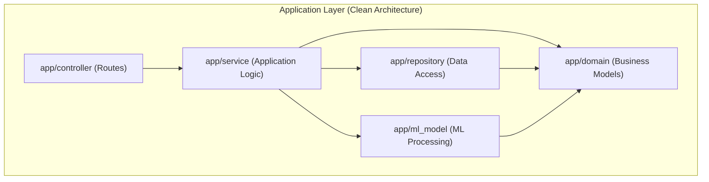

# Architecture: Human Image Classifier

## 1. System Overview
The project follows **Clean Architecture** to ensure maintainability, testability, and separation of concerns. The flow starts from the user uploading a face image via the frontend, passing it to the FastAPI controller, processing it through the service layer which interacts with the ML model and references the pre-calculated embeddings repository, and returning the most similar celebrity to the user.

## 2. Directory Structure

- **app/controller**: Web interfaces (FastAPI endpoints). Translates HTTP requests to internal service calls.
- **app/service**: Core application logic. Manages face detection, embedding extraction, and similarity calculation.
- **app/repository**: Data access layer. Loads and retrieves stored celebrity embeddings and metadata.
- **app/domain**: Pure business objects and logic. Defines `CelebrityMatch`, `FaceEmbedding`, etc.
- **app/ml_model**: Machine learning components. Wraps the CNN model (FaceNet/InsightFace).

## 3. Data Flow
1. **User Action**: Upload an image through the web interface (FastAPI).
2. **Controller**: Validates input and sends the image data to the `RecommendationService`.
3. **Service**:
    - Calls `MLModel` to detect the face and extract the 512-dimension embedding.
    - Retrieves celebrity embeddings from `EmbeddingRepository`.
    - Calculates Cosine Similarity between the user's embedding and all celebrity embeddings.
    - Sorts and picks the top match.
4. **Repository**: Loads the pre-processed `celebrity_embeddings.npy` or similar storage.
5. **Controller**: Formats the `CelebrityMatch` domain object into a JSON response.
6. **Frontend**: Displays the result.

## 4. Design Principles
- **Dependency Rule**: Dependencies only point inwards (towards Domain).
- **Abstractions**: Define interfaces for repository and ML model to allow easy swapping (e.g., switching from FAISS to a simple numpy array storage).
- **Single Responsibility**: Each layer has a well-defined role in the classification pipeline.
